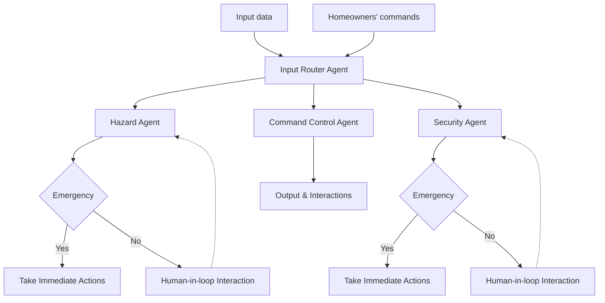

# SafeHome_AI
### Challenge
Despite the rapid adoption of smart home sensors and automation devices, today’s systems still fail at the most critical responsibility: keeping the home truly safe without constant human oversight. Current devices operate in isolation, gas sensors detect leaks but cannot reason about severity, temperature sensors report anomalies without understanding outdoor conditions, and motion detectors trigger false alarms that confuse homeowners more than they protect them. As a result, smart homes generate scattered alerts instead of interpreting them, taking appropriate actions based on severity and emergency cases, or managing necessary human-in-the-loop interventions, often overwhelming users rather than assisting them.

### Solution
Creating a multiagentic system for smart home technology is a potential solution. Instead of relying on isolated devices, the multiagent architecture uses a collection of specialized, autonomous agents, each acting as a domain expert, to interpret events, reason about context, and collaborate to determine the safest response, increasing overall intelligence and accuracy of the system. This enables continuous background monitoring that only escalates meaningful risks, thereby eliminating alert fatigue and building user trust. This approach also enables hybrid autonomy, allowing the system to distinguish between emergencies that require immediate action and cases where human approval is more appropriate. Plus, its modular structure ensures long-term scalability and allows new sensors, agent types, or capabilities to be added without redesigning the system, making it suitable for deployment across millions of homes.

### Architecture of a Multi-Agent Smart Home System

### Chat Interface 

