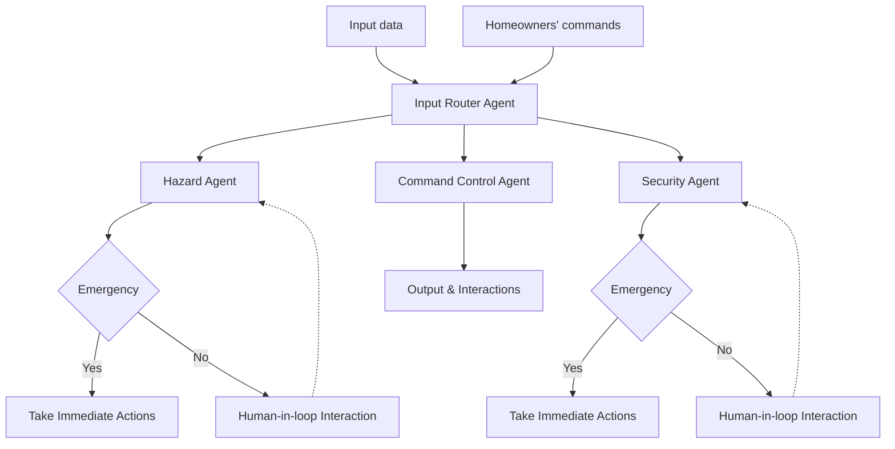

# SafeHome_AI
### Challenge
Despite the rapid adoption of smart home sensors and automation devices, today’s systems still fail at the most critical responsibility: keeping the home truly safe without constant human oversight. Current devices operate in isolation, gas sensors detect leaks but cannot reason about severity, temperature sensors report anomalies without understanding outdoor conditions, and motion detectors trigger false alarms that confuse homeowners more than they protect them. As a result, smart homes generate scattered alerts instead of interpreting them, taking appropriate actions based on severity and emergency cases, or managing necessary human-in-the-loop interventions, often overwhelming users rather than assisting them.

### Solution
Creating a multiagentic system for smart home technology is a potential solution. Instead of relying on isolated devices, the multiagent architecture uses a collection of specialized, autonomous agents, each acting as a domain expert, to interpret events, reason about context, and collaborate to determine the safest response, increasing overall intelligence and accuracy of the system. This enables continuous background monitoring that only escalates meaningful risks, thereby eliminating alert fatigue and building user trust. This approach also enables hybrid autonomy, allowing the system to distinguish between emergencies that require immediate action and cases where human approval is more appropriate. Plus, its modular structure ensures long-term scalability and allows new sensors, agent types, or capabilities to be added without redesigning the system, making it suitable for deployment across millions of homes.

### Architecture of a Multi-Agent Smart Home System

To address real-world home safety and automation challenges, a Smart Home AI multi-agent system was built. It was composed of four specialized agents: the Input Router Agent, Hazard Agent, Security Agent, and Command Control Agent. Each agent handles a specific category of events or user requests, enabling fast, context-aware decision-making.

#### Input Router Agent
The Input Router Agent is the core coordinator of the system. It classifies every incoming event, either an emergency or a user command, and routes it to the correct agent. Emergency events are forwarded to the Hazard or Security Agent for immediate action, while user commands are delegated to the Command Control Agent to execute the requested tasks.

#### Hazard Agent
The Hazard Agent handles all hazard-related events. Upon receiving a hazard alert from the Input Router Agent, it evaluates severity and invokes the appropriate tools or APIs when necessary. For example, by integrating a weather API, the Hazard Agent can automatically adjust indoor temperature based on outdoor conditions.

#### Security Agent
The Security Agent manages home security events. If it receives alerts such as a door opening at 3 A.M. or suspicious motion detected while the homeowner is away, it takes immediate and context-appropriate actions, such as locking doors, notifying the homeowner or neighbors, or escalating to emergency services if required.

#### Command Control Agent
The Command Control Agent processes direct user commands. When the homeowner makes a request (e.g., turning on lights, adjusting thermostat), this agent interprets the command and executes the corresponding actions across the smart home system.

### Essential Tools & Utilities
- Google Agent Development Kit (Google ADK) 
- Google Gemini API
- - preprocess_vision_events
  - preprocess_sound_events
- Open Mateo Weather API
- 

### Web UI Interface 

### Conclusion
The strength of the Smart Home Multi-Agent System lies in its autonomous, cooperative workflow. Each agent—Input Router, Hazard, Security, and Command Control—operates with a focused specialization, yet they work together through a shared reasoning loop. The Input Router Agent orchestrates the system by intelligently directing events, while the Hazard and Security Agents provide critical safety evaluations and responses. The Command Control Agent translates homeowner requests into precise system actions.

This coordinated multi-agent framework enables the smart-home environment to respond dynamically to emergencies, automate safety decisions, and execute user commands with minimal friction. Built using the Google Agent Development Kit (ADK), the system is modular, transparent, and scalable, making it easy to extend with new tools, devices, or decision layers. Ultimately, the system is a compelling demonstration of how multi-agent intelligence can transform everyday home management into a safer, more efficient, and more proactive experience.

### Value Statement
The Smart Home Multi-Agent System significantly reduces the cognitive load on homeowners by automating routine tasks and responding intelligently to unexpected events. The system improves home safety by reacting to hazard and security threats in real time, while also streamlining daily command-based actions such as adjusting temperature or locking doors. This automation saves homeowners time, prevents potential emergencies, and creates a more responsive living environment.

If expanded, the system would include a Human-in-the-Loop module for non-urgent alerts, ensuring the homeowner can review and approve actions before they are executed. I would also add an Environmental Awareness Agent to monitor weather, air quality, crime patterns, and energy data, giving the system stronger predictive insight. With additional APIs, device tools, and MCP integrations, the platform can become more context-aware and reliable while preserving homeowner oversight in non-emergency situations.

#### Huggingface: [Link](https://huggingface.co/spaces/kyileiaye2019/safe-home-ai/tree/main)
#### Web: [Link](https://huggingface.co/spaces/kyileiaye2019/safe-home-ai)
