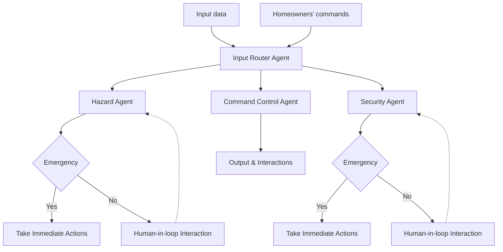

# SafeHome_AI
### Challenge
Despite the rapid adoption of smart home sensors and automation devices, today’s systems still fail at the most critical responsibility: keeping the home truly safe without constant human oversight. Current devices operate in isolation, gas sensors detect leaks but cannot reason about severity, temperature sensors report anomalies without understanding outdoor conditions, and motion detectors trigger false alarms that confuse homeowners more than they protect them. As a result, smart homes generate scattered alerts instead of interpreting them, taking appropriate actions based on severity and emergency cases, or managing necessary human-in-the-loop interventions, often overwhelming users rather than assisting them.

### Solution
Creating a multiagentic system for smart home technology is a potential solution. Instead of relying on isolated devices, the multiagent architecture uses a collection of specialized, autonomous agents, each acting as a domain expert, to interpret events, reason about context, and collaborate to determine the safest response, increasing overall intelligence and accuracy of the system. This enables continuous background monitoring that only escalates meaningful risks, thereby eliminating alert fatigue and building user trust. This approach also enables hybrid autonomy, allowing the system to distinguish between emergencies that require immediate action and cases where human approval is more appropriate. Plus, its modular structure ensures long-term scalability and allows new sensors, agent types, or capabilities to be added without redesigning the system, making it suitable for deployment across millions of homes.

### Architecture of a Multi-Agent Smart Home System

To solve the problem, Smart Home AI multiagent system was built. Smart Home AI system consists of four AI agents that contributes to the system: Input Router Agent, Hazard Agent, Security Agent, and Command Control Agent. 

#### Input Router Agent
Input Router Agent is a core of the multiagent system which directs the cases to relevant agents. When the emergency events are detected, it directs the events to corresponding hazard/security agents that alert the homeowener. When user command message was prompted, the input router agent sent request to the command control agent and conduct the task. 

#### Hazard Agent

#### Security Agent

#### Command Control Agent

### Essential Tools & Utilities

### Web UI Interface 

### Conclusion

### Value Statement

#### Huggingface: [Link](https://huggingface.co/spaces/kyileiaye2019/safe-home-ai/tree/main)
